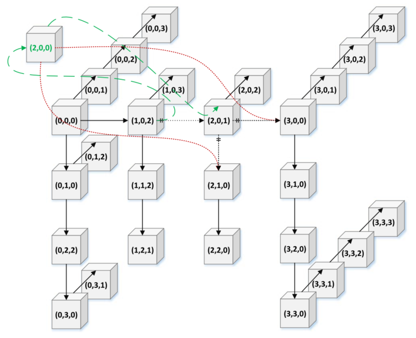
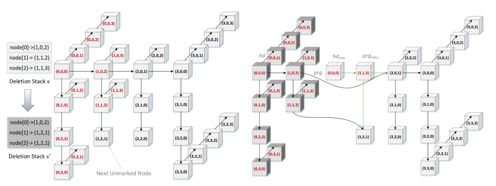

# Lock-Free Priority Queue Based on Multi-Dimensional Linked Lists

Authors: [Yumin Chen](https://github.com/yuminc1234) and [Jun Tao Luo](https://github.com/juntaoluo)

Links:
- [Project Proposal](docs/Project%20Proposal.pdf)
- [Milestone Report](docs/Milestone%20Report.pdf)

## Summary

We are going to investigate the performance of a concurrent lock-free priority queue based on multi-dimensional linked lists, which guarantees the worst-case sequential search time of O(logN).

## Background

Scalable concurrent priority queues, which are pivotal to topics such as the realization of parallelizing search algorithms, priority task scheduling and discrete event simulation, has been a research topic for many years. INSERT and DELELETEMIN are two canonical operations of a priority queue. In sequential execution scenarios, priority queues can be implemented on top of balanced search trees or array-based binary heaps. However, these two implementations both encounter bottlenecks in concurrent situations for maintaining a consistent global data structure. Recently, researchers attempted to solve this problem by applying skiplists and attained a great breakthrough. The skiplist solution organized several linked lists into different levels to eliminate the need of rebalancing and at the same time separate the memory use within different parts of the structure, which allows concurrent access to the data structure. However, the solution is still deficient in some regards. Both of the operations are restricted by the dependency of data within the structure and limits the overall throughput.

As a performance baseline, we will implement a fine-grained priority queue[2]. Inspired by the ideas of [1], we will investigate the performance of a concurrent lock-free priority queue based on MDList that guarantees a worst-case search time of O(logN). Based on MDList, we are going to implement the concurrent insertion with two steps: node splicing and child adoption[Figure 1], which only updates at most two consecutive nodes.


*Figure 1: Insert operation in a 3DList*

For the deleteMin operation, we will apply both logical and physical deletion while maintaining a deletion stack to provide the operation the information about the position of the next smallest node to reduce node traversal [Figure 2].


*Figure 2: Logical and Physical Deletion*

Finally, we will analyze the performance of the MDList concurrent lock-free priority queue given variations in parameters such as the number of threads and the number of dimensions of the linked list using various traffic loads. Finally we will benchmark the performance against some well-established concurrent lock-free priority queue implementation, if applicable, such as TBBPQ by intel and LJPQ by Herlihy and Shavit[3] on NUMA systems.

## The Challenge

- Firstly, to decouple different parts of the priority queue to make parallelism possible, we need to maintain a complicated MDList structure and establish a delicate mechanism for the INSERT and DELETE operations. The efforts include conducting lazy modification, preserving multiple flags to indicate the current status of the nodes and building extra data structures, such as stacks, to reduce duplicative traversal over the nodes.
- For the correctness and performance evaluation part, we need to develop a benchmarking script and even implement our own version of sequential and skiplist priority queue to compare the operation efficiency of INSERT and DELETEMIN operations for different versions of priority queue.
- There is also tuning work involved. The overall performance of the priority queue is highly related to the number of dimensions we chose and the number of threads. We need to explore as much as possible to find the relationship between these two parameters.
- We would like to use the concepts we learned in lecture to see if we can identify additional improvements in the MDList implementation of priority queue.

## Resources

For the code base, we will build the data structure from scratch with the help of pseudo code provided in [1]. For parallel machine resources, we plan to gather performance data on the PSC Bridges-2 RM.

## Goals and Deliverables

- PLAN TO ACHIEVE
  - Implement a coarse-grained concurrent priority queue
  - Implement a concurrent lock-free priority queue based on multi-dimensional linked lists in C++, which theoretically can achieve an average of 50% speedup over other versions of priority queue[1].
  - Implement a benchmarking script to evaluate the performance of the concurrent lock-free priority queue and come up with an analysis report regarding the influence of both the dimensions and number of threads on the throughput
- HOPE TO ACHIEVE
  - Compare the performance of different versions of concurrent priority queue(e.g. TBBPQ and LJPQ) with the MDList priority queue
  - Improve the concurrent lock-free priority queue based on profiling statistics, such as memory access and cache management using concepts learned in the course
  - Implement a fine-grained concurrent priority queue
- Demo plan to show at poster session
  - Graphs displaying the comparison of the performance of coarse-grained concurrent priority_queue and the MDList lock-free concurrent priority_queue across different threads, and different INSERT / DELETEMIN ratios.
  - Graphs displaying the lock-free concurrent priority queue’s performance across different workload ratio(e.g. 50% of INSERT, 75% of INSERT), different number of threads and different number of dimensions
  - The comparison of skiplist lock-free concurrent priority queue and MDList lock-free concurrent priority queue across different number of threads

## Platform Choice

We will implement the priority_queue in C++ and develop the benchmark scripts in Python. Experiments will be conducted on PSC machines because it can easily scale from 1 core to 256 cores allowing for more comprehensive study into the performance of the data structure when scaling to larger systems. We also chose this platform due to our familiarity and the reliability of performance statistics since we can guarantee exclusive access to a node for benchmarking.

## Schedule


| Week      | Task | Assignee |
| ----------- | ----------- | ----------- |
| Nov. 7 - Nov. 13      | Finish project proposal and study related research paper thoroughly | Completed, Jun Tao Luo and Yumin Chen |
| Nov. 14 - Nov. 20   | Build Data Structures, including Node, Stack, AdoptDesc and PriorityQueue | Completed, Yumin Chen |
| Nov. 14 - Nov. 20   | Implement the coarse-grained concurrent priority queue | Completed, Jun Tao Luo |
| Nov. 21 - Nov. 27   | Implement concurrent DELETEMIN, including Logical deletion and batch physical deletion | Completed, Yumin Chen |
| Nov. 21 - Nov. 27   | Start to work on project milestone report | Completed, Jun Tao Luo and Yumin Chen |
| Nov. 21 - Nov. 27   | Implement benchmark scripts and reference algorithm (parallel Dijkstra’s) using concurrent priority queues. | Completed, Jun Tao Luo |
| Nov. 30   | Finish the project milestone report | Completed, Jun Tao Luo and Yumin Chen |
| Dec. 2   | Implement concurrent INSERT | In Progress, Jun Tao Luo |
| Dec. 2   | Test and debug correctness of the MDList priority queue | In Progress, Yumin Chen |
| Dec. 6   | Profile the MDList priority queue, and analyze performance | Pending, Yumin Chen |
| Dec. 6   | Create graphs showing performance statistics and make comparisons with other mature lock-free concurrent priority-queue if applicable | Pending, Jun Tao Luo |
| Dec. 9   | Final project report draft | Pending, Jun Tao Luo |
| Dec. 9   | Final project poster draft | Pending, Yumin Chen |
| Dec. 9   | Evaluate feasibility of HOPE TO ACHIEVE tasks | Pending, Jun Tao Luo and Yumin Chen |
| Dec. 13   | Complete final project report | Pending, Jun Tao Luo |
| Dec. 13   | Complete HOPE TO ACHIEVE tasks | Pending, Jun Tao Luo and Yumin Chen |
| Dec. 17   | Complete final project poster | Pending, Yumin Chen |

## Current Progress

We changed the order of some of the tasks outlined in our original proposal, but the planned items are mostly unchanged.

In addition to using only microbenchmarks as a method to evaluate our data structure in our proposal, we decided to add a reference algorithm as a more realistic benchmark. For this purpose we have implemented a parallelized Dijkstra’s algorithm that uses a concurrent priority queue [4]. This has a further benefit of allowing us to empirically confirm the correctness of the concurrent priority queue by comparing the results of the parallelized algorithm with the sequential algorithm.

We have completed our testing harness which includes scripts to generate input graphs for parallelized Dijkstra’s algorithm, test the correctness of the output and compute the performance of the parallelized algorithm using different implementations of concurrent priority queues against the sequential algorithm and each other. We have put off writing specific microbenchmarks since we believe it will be simple but potentially dependent on the exact APIs of each of our priority queue implementations so we’ll work on this once we complete our priority queue implementations.

For the implementation of MDList based lock free concurrent priority queue, we have implemented the data structures it uses, the DeleteMin algorithm and are currently working on Insert. We are also in the process of debugging our current implementation and have not yet tested the functionality end to end using our parallelized Dijkstra’s algorithm.

## Preliminary Results

We measured the speed up for coarse-grained concurrent priority queue compared to the sequential implementation of priority queue of `std::priority_queue` for the Dijkstra’s benchmark:

```
 -- Performance Table ---
 Scene Name      | 4               | 8
-----------------------------------------------------
 bench-64        | 0.000247        | 0.000989
 bench-256       | 0.0003          | 0.000503
 bench-1024      | 0.002944        | 0.00348
 bench-4096      | 0.032007        | 0.032112
 bench-8192      | 0.12489         | 0.11085

-- Speedup Table ---
 Scene Name      | 4               | 8
-----------------------------------------------------
 bench-64        | 0.068826        | 0.017189
 bench-256       | 0.946667        | 0.564612
 bench-1024      | 1.756454        | 1.485920
 bench-4096      | 3.089168        | 3.079067
 bench-8192      | 3.310625        | 3.729941
```

## References

[1] Zhang, D., & Dechev, D. (2016). A lock-free priority queue design based on multi-dimensional linked lists. IEEE Transactions on Parallel and Distributed Systems, 27(3), 613–626. https://doi.org/10.1109/tpds.2015.2419651
[2] Hunt, G. C., Michael, M. M., Parthasarathy, S., & Scott, M. L. (1996). An efficient algorithm for concurrent priority queue heaps. Information Processing Letters, 60(3), 151–157. https://doi.org/10.1016/s0020-0190(96)00148-2
[3] M. Herlihy and N. Shavit, The Art of Multiprocessor Programming, Revised Reprint. Amsterdam, The Netherlands: Elsevier, 2012.
[4] Tamir, O., Morrison, A., & Rinetzky, N. (2016). A heap-based concurrent priority queue with mutable priorities for faster parallel algorithms. In 19th International Conference on Principles of Distributed Systems (OPODIS 2015).